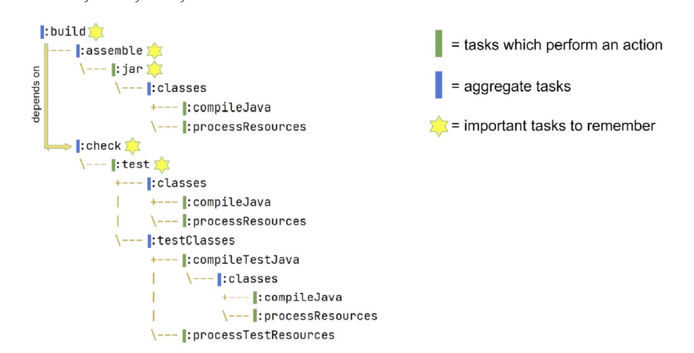
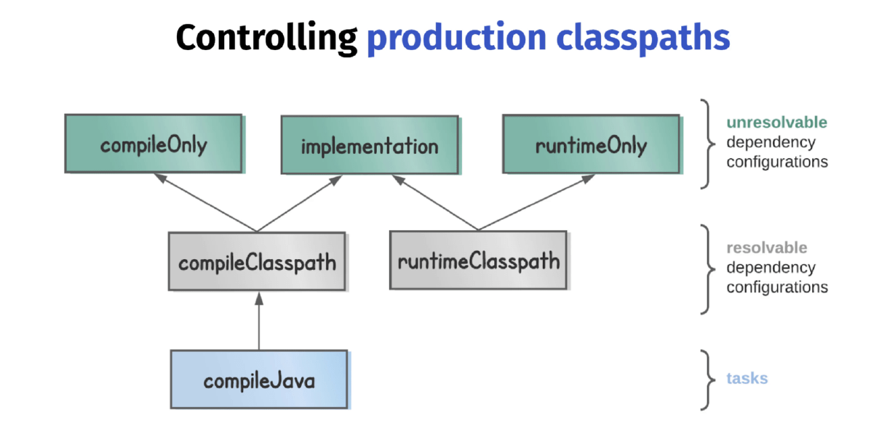
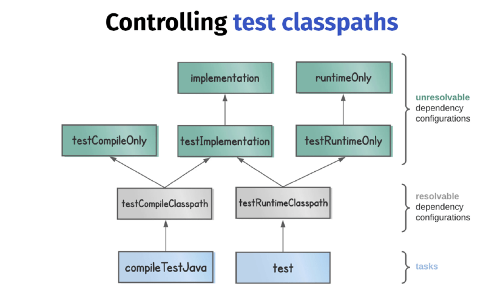
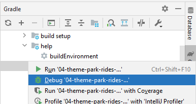
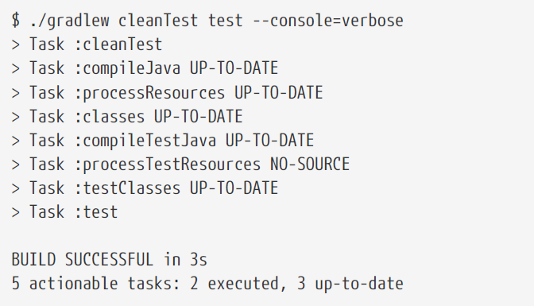

# Gradle Build Bible

build script = build.gradle or build.gradle.kts

- _build.gradle_ = Gradle build script definition
- _settings.gradle_ = project name and other project settings
- _build_ directory which containts generated filed and artifacts

The highest level Gradle concept is the project. Builds scripts configures project. Project is a Java object.

### Closures

- Groovy Closures - see https://groovy-lang.org/closures.html

Closure delegates
- Each closure has a delegate object - usable to look up variables and method references to non-local variables and closure parameters.
- Heavily used for configuration, where delegate object refers  to object being configured.

```groovy
dependencies {
    assert delegate == project.dependencies
    testImplementation("junit:junit:4.13")
    delegate.testImplementation("junit:junit:4.13")
}
```

### Project configuration

- description ... shown when you execute the projects task
- group - describes who the project belongs to - describes the orhanization - its used as an ID when publishing artifacts
- version - used when publishing artifacts


## Build lifecycle

- Initialization - finds out what projects take part in our build
- Configuration - task preparation, creates model of our projects
- Execution - executes tasks using command line settings

## Tasks

Task class is a blueprint for a task. Copy task comes pre-packaged and we can use it within our project after we :
- define an instance of that task class
- configure instance -> telling Copy about details like from and into.

Ad-hoc tasks combines task class and its definition at the same point. Example:

```groovy
tasks.register('sayHello') {
    doLast {
        println 'Hello'
    }
}
```

### Task creation

#### 1) Tasks.register

Best approach as it avoid unnecesary configuration. Class-based task (of Copy class):
See more about performance: https://docs.gradle.org/current/userguide/task_configuration_avoidance.html

```groovy
tasks.register('generateDescriptions', Copy) {
// configure task
}
```

#### 2) task

Uses [Project.task()](https://docs.gradle.org/current/javadoc/org/gradle/api/Project.html#task-java.lang.String-) method. Has worse performance

```groovy
task('generateDescriptions', type: Copy)
```

Example of class based task:
```groovy
task generateDescriptions(type: Copy) {
    from 'descriptions'
    into "$buildDir/descriptions"
    filter(ReplaceTokens, tokens: [THEME_PARK_NAME: "Grelephant's Wonder World"])
}
```

### Locating tasks

Configuration of already defined tasks.

#### 1) tasks.named

The best performance, recommended - it returns TaskProvider class instead of Task class. Perf benefits -- see book.

```groovy
tasks.named('generateDescriptions') {
    into "$buildDir/descriptions-renamed"
}
```

#### 2) tasks.getByName

Returns Task class -- slower.

```groovy
tasks.getByName('generateDescriptions') {
into "$buildDir/descriptions-renamed"
}
```

#### 3) tasks.\<taskName>

Do not have to work with all plugins.

```groovy
tasks.clean {
    doLast {
        println 'Squeaky clean!'
        
    }
}
```

#### 4) \<taskName>

In Groovy DSL it is possible to use configuration by using task name.
Unfortunately it also returns Task so there is perf downside.


```groovy
clean {
    doLast {
        println 'Squeaky clean!'
    }
}
```

### Task dependencies and ordering

- **dependsOn** prepareOutput - current task needs input from _prepareOutput_. Means that _prepareOutput_ will be executed automatically before the current task. 
- **mustRunAfter** zipAll - forces task order - current task must run after task B (it has effect of both tasks are actually going to take part int the build)
- **finalizedBy** taskA - taskA will be always executed after this task. TaskA will be executed even if the current task fails. Similar to finally section in try-catch. 

### Input and output linking

- https://docs.gradle.org/current/userguide/incremental_build.html#sec:link_output_dir_to_input_files
- https://docs.gradle.org/current/javadoc/org/gradle/api/tasks/TaskInputs.html

### Applying plugins

Recommended definition:

```groovy
plugins {
    id 'org.barfuin.gradle.taskinfo' version '1.3.1'
}
```

Legacy definition with missiong optimisations and IntelliJ IDEA broken integration:

```groovy
buildscript {
    repositories {
        maven {
            url "https://plugins.gradle.org/m2/"
        }
    }
    dependencies {
        classpath "gradle.plugin.org.barfuin.gradle.taskinfo:gradle-taskinfo:1.3.1"
    }
}
apply plugin: "org.barfuin.gradle.taskinfo"
```

How to search 3dr party plugins: https://plugins.gradle.org/ </br>
Core Gradle plugins: https://docs.gradle.org/current/userguide/plugin_reference.html

### Repositories and Dependencies

When searching for dependencies, repositories are used in provided order - declare the repo with the most dependencies first. 

```groovy
repositories {
    mavenCentral()
    google()
    maven {
        url 'https://my-custom-repo.com'
    }
}
```

**Java** **classpath** = list of files passed to Java when it complies and executes the code.
- Analogy in Gradle are compile and runtime classpaths.

Example how to declare **runtime**+**compile** time dependency with excluded transitive dependency.

```groovy
dependencies {
    implementation(group = "commons-beanutils", name = "commons-beanutils", version =
            "1.9.4") {
        exclude(group = "commons-collections", module = "commons-collections")
    }
}
```

## CH4 Working with Java projects in Gradle

**Essential features** for building Java applications:
 - Compiling classes ( .java -> .class)
   - `./gradlew compileJava` 
 - Manage resources (other files like HTML, images, ...)
    - `./gradlew processResources`
 - Handle dependencies (references to app dependencies)
   - dependencies block 
 - Package - put all classes and resources into a single artifact
   - `./gradlew jar`
 - Run tests (they mostly need different classpath then main application)
   - `./gradlew test`

**Developer workflow features** expected from build tools:
 - run app
 - manage Java versions
 - seperate unit & integration tests
 - publish artifact

### 4.2 The Gradle Java plugin

java plugin adds tasks for essential features mentioned above.

```groovy
plugins {
    id 'java'
}
```

Project layout that is expected by java plugin.

- `src/main/java` Java plugins expects to find classes there
- `src/main/resources` resources
- `src/test/java` test classes
- `src/test/resources` test resources


### 4.3 Building a Java project with Gradle

Running .jar file using java -jar and there is "no main manifest attribute" error?

```text
no main manifest attribute, in ./build/libs/06-theme-park-rides-status.jar
```

That means that Java doesn't know which class to execute. We can fix this by adding manifest:

```groovy
tasks.named('jar') {
   manifest {
      attributes('Main-Class': 'com.gradlehero.themepark.RideStatusService')
   }
}
```

### 4.4 Tasks in Java projects

Gradle _build_ task has no actions, it only aggregate _assemble_ and _check_ tasks together.
- Similar tasks like _build_ tasks are sometimes called lifecycle tasks in Gradle documentation.



Plugin to print task dependencies: https://github.com/dorongold/gradle-task-tree.
 - `./gradlew build taskTree` 

### 4.5 Dependencies in Java projects

Production classpaths
- _compile classpath_ to compile production code
- _runtime classpath_ to run compiled code

Why not to make life easier and use the same classpath for compiling and running?
- compile classpath clean = compilation is more efficient, since Java doesn't have to load unnecessary libraries
- runtime classpath clean = reduced size of our deployable (not needed libraries are not included)



#### 4.5.1 Resolvable vs Unresolvable

**Resolvable** = classpath can be generated from them. However, you can't declare dependencies againts them.
- A configuration that can be resolved is a configuration for which we can compute a dependency graph, because it contains all the necessary information for resolution to happen.That is to say we’re going to compute a dependency graph, resolve the components in the graph, and eventually get artifacts. 
- [See Gradle userguide](https://docs.gradle.org/current/userguide/declaring_dependencies.htm)

**Unresolvable**
- A configuration which has canBeResolved set to false is not meant to be resolved. Such a configuration is there only to declare dependencies.

To some extent, this is similar to an abstract class (canBeResolved=false) which is not supposed to be instantiated, and a concrete class extending the abstract class (canBeResolved=true). A resolvable configuration will extend at least one non-resolvable configuration (and may extend more than one).

#### 4.5.2 Classpath types 

**compileOnly** - useful when an app will be deployed in an environment where that library is already provided. For example servlet-api which is provided by Tomcat instance. </br>
**implementation** - the most used - when application's code interacts directly with the code from library. For example StringUtils from Apache commons-lang3 - that library needs to be on **compile and _runtime_ classpath = needs to be declared againts implementation.</br>
**runtimeOnly** - for example DB connector (JDBC, JPA) which will be included at runtime

**Test classpaths**




**Annotation procesors**

When Java code is compiled it has a nice feature whereby additional source files can be generated
by so-called annotation processors. The Java compiler accepts a processor path option on the
command line, which is a list of all the annotation processor libraries.

The `nnotationProcessor` dependency configuration is used to control this processor path.

One example of this is the mapstruct library which generates mappers, classes which map one data
representation to another.

```groovy
annotationProcessor 'org.mapstruct:mapstruct-processor:1.4.2.Final'
```

Another example is when you’re using the lombok library, which at compile time can generate
boilerplate code like equals, hashCode, and toString methods.

```groovy
annotationProcessor 'org.projectlombok:lombok:1.18.20'
```

### 4.6 Build customisations

Now imagine we want to configure both compileJava and compileTestJava in the same way. Rather
than configuring each task separately, there’s a way you can locate tasks by class type.

```groovy
tasks.withType(JavaCompile).configureEach {
    options.verbose = true
}
```

Situation - we process our project resources with the command `processResources` and we don't want that some files ends up in producition jar. We [can define](https://docs.gradle.org/current/dsl/org.gradle.api.tasks.Copy.html) _include_/_exclude_ pattern like this:

```groovy
tasks.named('processResources'){
    include '**/*.txt' //OR includes = '*.txt'
}
```

**How to customise .jar?** 

For example to change jar name:
```groovy
tasks.named('jar'){
    archiveBaseName = 'parkRideStatus'
}
```

### 4.7 Running Java applications

We can use _application_ plugin to run application like `./gradlew run`. It doesn't build .jar, it depends only on the "classses" task (compile Java and resources).

To properly run our application we need to define main class:

```groovy
plugins {
   id 'application'
}

application { // Configuring application plugin mainClass
   mainClass = 'com.gradlehero.themepark.RideStatusService'
}
```

We can also create a custom task to run app from .jar file:

```groovy
tasks.register('runJar', JavaExec) {
    classpath tasks.named('jar').map { it.outputs } // take output of jar task and put it under runJar classpath
    classpath configurations.runtimeClasspath // adds also runtime libraries (implementation and compileOnly)
    args ' teacups'
    mainClass = 'com.gradlehero.themepark.RideStatusService' // in case there are multiple jars (from dependencies), we need to define mainClass
}
```

It is possible to debug Gradle tasks




### 4.8 Testing Java applications

See [this](https://docs.gradle.org/current/dsl/org.gradle.api.tasks.testing.Test.html) page.

If your application uses a lot of memory, you might consider changing maxHeapSize, which defaults
to 512mb.

```groovy
  // set heap size for the test JVM(s)
  minHeapSize = "128m"
  maxHeapSize = "512m"
```

It is possible to run Gradle tests with [various settings](https://docs.gradle.org/current/userguide/java_testing.html#simple_name_pattern) like:
```
./gradlew test --tests org.gradle.SomeTestClass.someSpecificMethod
```

**cleanTest (for flaky tests)**

- Tests are cached by default and in case there are no changes to code, then the Gradle expect that the results will be the same again. 
To re-run test again use `cleanTest` to prevent unneeded build of the whole project. Do not use `clean`!




### 4.9 Adding integration tests to a project

It is a good practise to have possibility to run unit and integration tests separately. We can use following plugin: 

```groovy
plugins {
    id 'org.unbroken-dome.test-sets' version '4.0.0'
}
```

### 4.10 Controlling Java versions

TODO


# Tips

- Verbose console: `--console=verbose `
- Wrapper upgrade from CMD `./gradlew wrapper --gradle-version 8.0.2`
- help for specific command `gradle help --task wrapper`
- Tasks default parameters (configuration like group, description, enabled) is [here](https://docs.gradle.org/current/javadoc/org/gradle/api/Task.html) - look for setters.
```groovy
tasks.register('sayBye') {
    doLast {
        println 'Bye!'
    }
    onlyIf {
        2 == 3 * 2
    }
}
```

- we should **avoid using mavenLocal()**, see detailed info [here](https://docs.gradle.org/current/userguide/declaring_repositories.html#sec:case-for-maven-local)

- Plugin to [print task dependencies](https://github.com/dorongold/gradle-task-tree.): 
  - `./gradlew build taskTree` 
