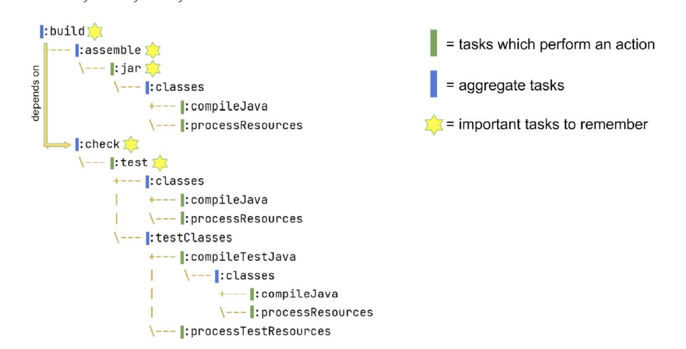
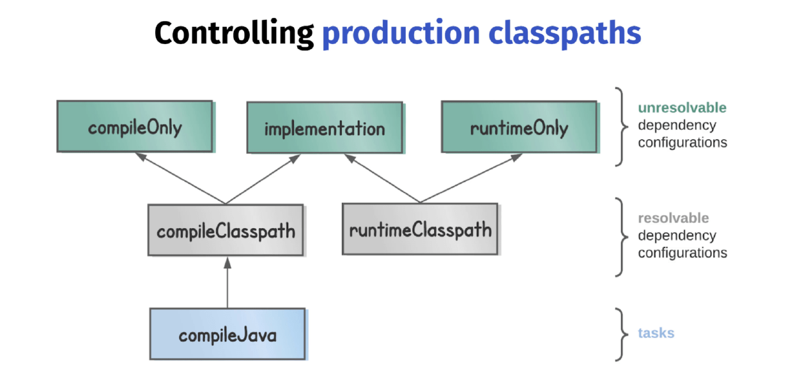
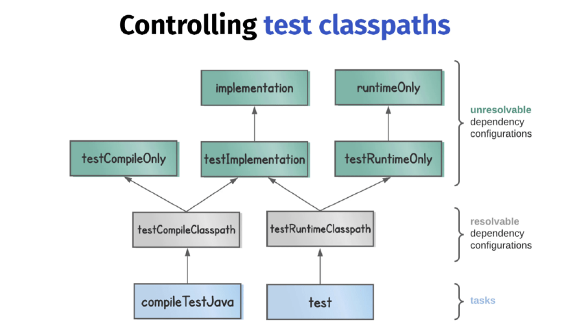
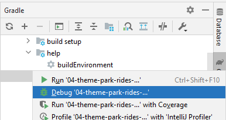
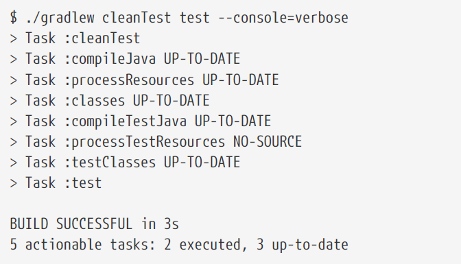
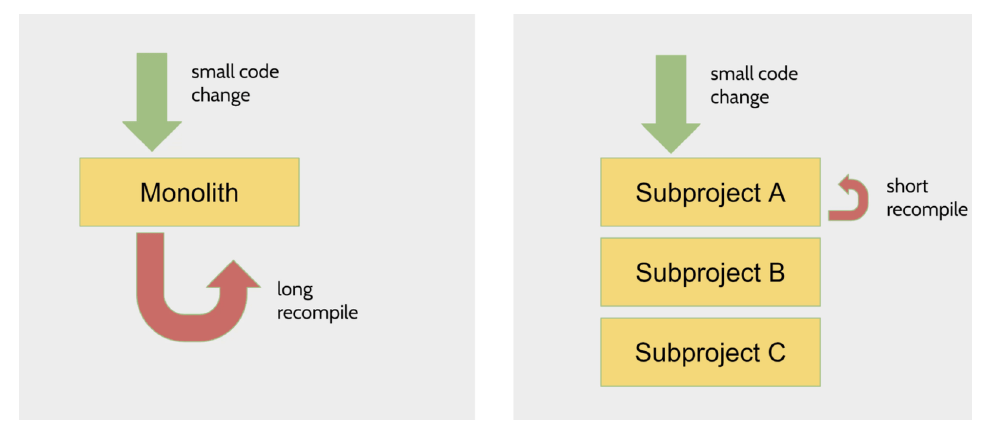

# Gradle Build Bible

build script = build.gradle or build.gradle.kts

- _build.gradle_ = Gradle build script definition
- _settings.gradle_ = project name and other project settings
- _build_ directory which containts generated filed and artifacts

The highest level Gradle concept is the project. Builds scripts configures project. Project is a Java object.

### Closures

- Groovy Closures - see https://groovy-lang.org/closures.html

Closure delegates
- Each closure has a delegate object - usable to look up variables and method references to non-local variables and closure parameters.
- Heavily used for configuration, where delegate object refers  to object being configured.

```groovy
dependencies {
    assert delegate == project.dependencies
    testImplementation("junit:junit:4.13")
    delegate.testImplementation("junit:junit:4.13")
}
```

### Project configuration

- description ... shown when you execute the projects task
- group - describes who the project belongs to - describes the orhanization - its used as an ID when publishing artifacts
- version - used when publishing artifacts


## Build lifecycle

- Initialization - finds out what projects take part in our build
- Configuration - task preparation, creates model of our projects
- Execution - executes tasks using command line settings

## Tasks

Task class is a blueprint for a task. Copy task comes pre-packaged and we can use it within our project after we :
- define an instance of that task class
- configure instance -> telling Copy about details like from and into.

Ad-hoc tasks combines task class and its definition at the same point. Example:

```groovy
tasks.register('sayHello') {
    doLast {
        println 'Hello'
    }
}
```

### Task creation

#### 1) Tasks.register

Best approach as it avoid unnecesary configuration. Class-based task (of Copy class):
See more about performance: https://docs.gradle.org/current/userguide/task_configuration_avoidance.html

```groovy
tasks.register('generateDescriptions', Copy) {
// configure task
}
```

#### 2) task

Uses [Project.task()](https://docs.gradle.org/current/javadoc/org/gradle/api/Project.html#task-java.lang.String-) method. Has worse performance

```groovy
task('generateDescriptions', type: Copy)
```

Example of class based task:
```groovy
task generateDescriptions(type: Copy) {
    from 'descriptions'
    into "$buildDir/descriptions"
    filter(ReplaceTokens, tokens: [THEME_PARK_NAME: "Grelephant's Wonder World"])
}
```

### Locating tasks

Configuration of already defined tasks.

#### 1) tasks.named

The best performance, recommended - it returns TaskProvider class instead of Task class. Perf benefits -- see book.

```groovy
tasks.named('generateDescriptions') {
    into "$buildDir/descriptions-renamed"
}
```

#### 2) tasks.getByName

Returns Task class -- slower.

```groovy
tasks.getByName('generateDescriptions') {
into "$buildDir/descriptions-renamed"
}
```

#### 3) tasks.\<taskName>

Do not have to work with all plugins.

```groovy
tasks.clean {
    doLast {
        println 'Squeaky clean!'
        
    }
}
```

#### 4) \<taskName>

In Groovy DSL it is possible to use configuration by using task name.
Unfortunately it also returns Task so there is perf downside.


```groovy
clean {
    doLast {
        println 'Squeaky clean!'
    }
}
```

### Task dependencies and ordering

- **dependsOn** prepareOutput - current task needs input from _prepareOutput_. Means that _prepareOutput_ will be executed automatically before the current task. 
- **mustRunAfter** zipAll - forces task order - current task must run after task B (it has effect of both tasks are actually going to take part int the build)
- **finalizedBy** taskA - taskA will be always executed after this task. TaskA will be executed even if the current task fails. Similar to finally section in try-catch. 

### Input and output linking

- https://docs.gradle.org/current/userguide/incremental_build.html#sec:link_output_dir_to_input_files
- https://docs.gradle.org/current/javadoc/org/gradle/api/tasks/TaskInputs.html

### Applying plugins

Recommended definition:

```groovy
plugins {
    id 'org.barfuin.gradle.taskinfo' version '1.3.1'
}
```

Legacy definition with missing optimisations and IntelliJ IDEA broken integration:

```groovy
buildscript {
    repositories {
        maven {
            url "https://plugins.gradle.org/m2/"
        }
    }
    dependencies {
        classpath "gradle.plugin.org.barfuin.gradle.taskinfo:gradle-taskinfo:1.3.1"
    }
}
apply plugin: "org.barfuin.gradle.taskinfo"
```

How to search 3dr party plugins: https://plugins.gradle.org/ </br>
Core Gradle plugins: https://docs.gradle.org/current/userguide/plugin_reference.html

### Repositories and Dependencies

When searching for dependencies, repositories are used in provided order - declare the repo with the most dependencies first. 

```groovy
repositories {
    mavenCentral()
    google()
    maven {
        url 'https://my-custom-repo.com'
    }
}
```

**Java** **classpath** = list of files passed to Java when it complies and executes the code.
- Analogy in Gradle are compile and runtime classpaths.

Example how to declare **runtime**+**compile** time dependency with excluded transitive dependency.

```groovy
dependencies {
    implementation(group = "commons-beanutils", name = "commons-beanutils", version =
            "1.9.4") {
        exclude(group = "commons-collections", module = "commons-collections")
    }
}
```

## CH4 Working with Java projects in Gradle

**Essential features** for building Java applications:
 - Compiling classes ( .java -> .class)
   - `./gradlew compileJava` 
 - Manage resources (other files like HTML, images, ...)
    - `./gradlew processResources`
 - Handle dependencies (references to app dependencies)
   - dependencies block 
 - Package - put all classes and resources into a single artifact
   - `./gradlew jar`
 - Run tests (they mostly need different classpath then main application)
   - `./gradlew test`

**Developer workflow features** expected from build tools:
 - run app
 - manage Java versions
 - seperate unit & integration tests
 - publish artifact

### 4.2 The Gradle Java plugin

java plugin adds tasks for essential features mentioned above.

```groovy
plugins {
    id 'java'
}
```

Project layout that is expected by java plugin.

- `src/main/java` Java plugins expects to find classes there
- `src/main/resources` resources
- `src/test/java` test classes
- `src/test/resources` test resources


### 4.3 Building a Java project with Gradle

Running .jar file using java -jar and there is "no main manifest attribute" error?

```text
no main manifest attribute, in ./build/libs/06-theme-park-rides-status.jar
```

That means that Java doesn't know which class to execute. We can fix this by adding manifest:

```groovy
tasks.named('jar') {
   manifest {
      attributes('Main-Class': 'com.gradlehero.themepark.RideStatusService')
   }
}
```

### 4.4 Tasks in Java projects

Gradle _build_ task has no actions, it only aggregate _assemble_ and _check_ tasks together.
- Similar tasks like _build_ tasks are sometimes called lifecycle tasks in Gradle documentation.



Plugin to print task dependencies: https://github.com/dorongold/gradle-task-tree.
 - `./gradlew build taskTree` 

### 4.5 Dependencies in Java projects

Production classpaths
- _compile classpath_ to compile production code
- _runtime classpath_ to run compiled code

Why not to make life easier and use the same classpath for compiling and running?
- compile classpath clean = compilation is more efficient, since Java doesn't have to load unnecessary libraries
- runtime classpath clean = reduced size of our deployable (not needed libraries are not included)



#### 4.5.1 Resolvable vs Unresolvable

**Resolvable** = classpath can be generated from them. However, you can't declare dependencies againts them.
- A configuration that can be resolved is a configuration for which we can compute a dependency graph, because it contains all the necessary information for resolution to happen.That is to say we’re going to compute a dependency graph, resolve the components in the graph, and eventually get artifacts. 
- [See Gradle userguide](https://docs.gradle.org/current/userguide/declaring_dependencies.htm)

**Unresolvable**
- A configuration which has canBeResolved set to false is not meant to be resolved. Such a configuration is there only to declare dependencies.

To some extent, this is similar to an abstract class (canBeResolved=false) which is not supposed to be instantiated, and a concrete class extending the abstract class (canBeResolved=true). A resolvable configuration will extend at least one non-resolvable configuration (and may extend more than one).

#### 4.5.2 Classpath types 

**compileOnly** - useful when an app will be deployed in an environment where that library is already provided. For example servlet-api which is provided by Tomcat instance. </br>
**implementation** - the most used - when application's code interacts directly with the code from library. For example StringUtils from Apache commons-lang3 - that library needs to be on **compile and _runtime_ classpath = needs to be declared againts implementation.</br>
**runtimeOnly** - for example DB connector (JDBC, JPA) which will be included at runtime

**Test classpaths**




**Annotation procesors**

When Java code is compiled it has a nice feature whereby additional source files can be generated
by so-called annotation processors. The Java compiler accepts a processor path option on the
command line, which is a list of all the annotation processor libraries.

The `nnotationProcessor` dependency configuration is used to control this processor path.

One example of this is the mapstruct library which generates mappers, classes which map one data
representation to another.

```groovy
annotationProcessor 'org.mapstruct:mapstruct-processor:1.4.2.Final'
```

Another example is when you’re using the lombok library, which at compile time can generate
boilerplate code like equals, hashCode, and toString methods.

```groovy
annotationProcessor 'org.projectlombok:lombok:1.18.20'
```

### 4.6 Build customisations

Now imagine we want to configure both compileJava and compileTestJava in the same way. Rather
than configuring each task separately, there’s a way you can locate tasks by class type.

```groovy
tasks.withType(JavaCompile).configureEach {
    options.verbose = true
}
```

Situation - we process our project resources with the command `processResources` and we don't want that some files ends up in producition jar. We [can define](https://docs.gradle.org/current/dsl/org.gradle.api.tasks.Copy.html) _include_/_exclude_ pattern like this:

```groovy
tasks.named('processResources'){
    include '**/*.txt' //OR includes = '*.txt'
}
```

**How to customise .jar?** 

For example to change jar name:
```groovy
tasks.named('jar'){
    archiveBaseName = 'parkRideStatus'
}
```

### 4.7 Running Java applications

We can use _application_ plugin to run application like `./gradlew run`. It doesn't build .jar, it depends only on the "classses" task (compile Java and resources).

To properly run our application we need to define main class:

```groovy
plugins {
   id 'application'
}

application { // Configuring application plugin mainClass
   mainClass = 'com.gradlehero.themepark.RideStatusService'
}
```

We can also create a custom task to run app from .jar file:

```groovy
tasks.register('runJar', JavaExec) {
    classpath tasks.named('jar').map { it.outputs } // take output of jar task and put it under runJar classpath
    classpath configurations.runtimeClasspath // adds also runtime libraries (implementation and compileOnly)
    args ' teacups'
    mainClass = 'com.gradlehero.themepark.RideStatusService' // in case there are multiple jars (from dependencies), we need to define mainClass
}
```

It is possible to debug Gradle tasks




### 4.8 Testing Java applications

See [this](https://docs.gradle.org/current/dsl/org.gradle.api.tasks.testing.Test.html) page.

If your application uses a lot of memory, you might consider changing maxHeapSize, which defaults
to 512mb.

```groovy
  // set heap size for the test JVM(s)
test {
    minHeapSize = "128m"
    maxHeapSize = "512m"
}
```

It is possible to run Gradle tests with [various settings](https://docs.gradle.org/current/userguide/java_testing.html#simple_name_pattern) like:
```
./gradlew test --tests org.gradle.SomeTestClass.someSpecificMethod
```

**cleanTest (for flaky tests)**

- Tests are cached by default and in case there are no changes to code, then the Gradle expect that the results will be the same again. 
To re-run test again use `cleanTest` to prevent unneeded build of the whole project. Do not use `clean`!




### 4.9 Adding integration tests to a project

It is a good practise to have possibility to run unit and integration tests separately. We can use following plugin: 

```groovy
plugins {
    id 'org.unbroken-dome.test-sets' version '4.0.0'
}

testSets {
    integrationTest // invokes the tests under src/integrationTest/java
}

// to invoke integrationTest together under test / check task
tasks.named('check') {
    dependsOn tasks.named('integrationTest')
}
```


### 4.10 Controlling Java versions

By default, Gradle uses JAVA_HOME or PATH environment variables.
- This is problematic, because there might be different Java version for different developers and production.

#### Java toolchains

- Secures that the specific Java version is used.
- It tries to find the version on localhost otherwise it will automatically download the version from the internet.
- You can use different version to compile, run and test my app.
  - Tasks _JavaExec_, _JavaCompile_ and _Test_ will use the version specified by toolchain config, but it can be overridden at the task level.

```groovy
// Use Java 11 by default for compile, run and test
java {
    toolchain {
        languageVersion = JavaLanguageVersion.of(11)
    }
}
// Application will run with Java 16 (overrides the settings above)
tasks.withType(JavaExec).configureEach {
    javaLauncher = javaToolchains.launcherFor {
        languageVersion = JavaLanguageVersion.of(16)
    }
}
```

### 4.11 Publishing to Maven

Publishing artifact = transferring artifact from the build directory to a remote Maven repository.

#### maven-publish plugin

To configure:
- the artifact we want to publish
- the repository where we want to publish


```groovy
plugins {
    id 'maven-publish'
}

publishing {
    // Artifact definition
    publications {
        maven(MavenPublication) {
            from components.java // from Java plugin, represents the jar file create by jar task
        }
    }
    // Target repo definition
    repositories {
        maven {
            name = 'maven'
            url '<your-repository-url>'
            credentials {
                username 'aws'
                password System.getenv("CODEARTIFACT_AUTH_TOKEN")
            }
        }
    }
}
```
- _components_ are defined by plugins and provide a simple way to reference a publication
  for publishing. This java component has been added by the java plugin, and represents the jar file
  created by the jar task.

#### Maven local

To publish your artifact to local Maven repo run `./gradlew publishToMavenLocal` (it needs group and version defined)

```groovy
group 'com.gradlehero'
version '1.0-SNAPSHOT'
```

Then you can find your jar in `~/.m2/repository/$group/version/YOUR_JAR` and run `java -jar YOUR_JAR`
- warning: the *.jar file may miss dependencies. To have complete bundle (fat jar) use Shadowplugin and its `shadowJar` task.

### 4.12 Practical: Building Spring Boot applications

Spring Boot has embedded web server, Tomcat by default -> you execute the jar file and Tomcat will start serving my app over the network.

There are 2 main plugins to work with Spring Boot
- Spring Boot plugin
  - run Spring Boot application
  - generate and executable jar file
- Spring Dependency Management plugin
  - Making sure Spring Boot dependencies stay consistent


#### Basic setup + commands

See build.gradle in _07-theme-park-api_.

```groovy
plugins {
    id 'java'
    id 'org.springframework.boot' version '3.0.6'
}
```

The plugin above provides `./gradlew bootRun` to run the app.
 - After running `./gradlew assemble` (which invokes `bootJar`) we can run simply `java -jar build/libs/07-theme-park-api.jar` to run the Spring Boot app from jar.

### 4.13 Building Java libraries

In Gradle you can build 2 types of Java projects:
1. **Application** 
   2. Standalone service which actually gets run, like web application, API service or desktop application.
   3. Consumer (consuming libraries)
3. **Library**
   4. Artifact that isn't intended to be run standalone, but is consumed by other libraries or applications to create something else. 
   5. Producer.

Why is consumer vs producer important?
- _implementation_ dependencies of the library will end up on the _runtime_ classpath of any consumer, but not on the _compile_ classpath.

**ABI** application binary interface
- Let's say we have the following method
- ```java
    public static ObjectNode getRideStatus(String ride) {
      List<String> rideStatuses = readFile(String.format("%s.txt", StringUtils.trim(ride)));
      String rideStatus = rideStatuses.get(new Random().nextInt(rideStatuses.size()));
      ObjectNode node = new ObjectMapper().createObjectNode();
      node.put("status", rideStatus);
      return node;
    }
    ```
  - In case we use a library with the following method. We will need _ObjectNode_ to be on our _**compile**_ classpath so we are able to operate with return value = ABI.
  - Whereas StringUtils.trim() is not the ABI, and it is needed only at _**runtime**_

What falls under ABI?
- return types (as ObjectNode in example above)
- public method parameters
- types used in parent classes or interfaces


#### Compile vs Runtime when using libraries

Due to ABI it may happen that we will need the following scenario in our consumer app:


What benefits would be to selectively build up classpaths like this?
- cleaner classpaths (faster compilation)
- won't accidentally use a library that we haven't depended on explicitly
- less recompilation, since we do not need to recompile when runtime classpath change

**The Java Library plugin** makes it possible using `api`.
  - `api` dependencies are part of the library's ABI.
    - Therefore, they will appear on the _compile_ and _runtime classpaths_ of any consumer.
  - `implementation` dependencies aren't part of the library's ABI, and will appear only on the _runtime classpath_ of consumers.

## CH5 Organising Gradle projects effectively

### 5.2 Project properties

Helpful to store passwords that we do not want to commit. 

```groovy
repositories {
    maven {
        url '<your-repository-url>'
        credentials {
            username 'aws'
            password mavenPassword // property
        }
    }
}
```

Then we can run the task with -P flag to add properties
 - `./gradlew publish -PmavenPassword=<password>`

Other examples:
- deployment - extra information like region to which to deploy.
- test memory allocation - configure maxHeapSize by different environments.
- DB connection string

**Passing project properties**
- Multiple ways with different priorities. Here are in descending order by prio:
1. command line 
   2. `./gradlew <task-name> -PmyPropName=myPropValue`
3. java system properties using -D
   4. `./gradlew <task-name> -Dorg.gradle.project.myPropName=myPropValue`
5. Environment variables
   6. `ORG_GRADLE_PROJECT_myPropName=myPropValue ./gradlew publish`
7. _gradle.properties_ file in user home directory
   8. Normally `~/.gradle/gradle.properties`
      8. `myPropName=myPropValue` ... key=value in the file above
9. _gradle.properties_ file in project root directory
   10. Commited to version control and shared to team.

**Non-project specific properties**
- Adding `org.gradle.console=verbose` to the `~/.gradle/gradle.properties` file and all local projects will be verbose.
- Documentation for the full list of [these properties](https://docs.gradle.org/current/userguide/build_environment.html#sec:gradle_configuration_properties).

**Accessing project properties**
```groovy
tasks.register('print') {
    doLast {
        println project.property('myPropName')
        println project.findProperty('myPropName') // when the property is not found, does not throw error, but returns null
        println project.findProperty('myPropName1') ?: 'defaultValue' // useful for default val
    }
    // check existence
    if (hasProperty('myPropName1')) {
        println 'Doing some conditional build logic'
    }
}
```

### 5.3 Multi-project builds

Why using multi-project builds?
- Modularisation - enforce interactions between layers
- Performance



When using sub-modules, the gradle tasks are prefixed with the subproject name. 
- `:app:run` instead of `run`

**Root project**

Top level project which contains:
  - `.gradle` cache,
  - _gradle directory_ with wrapper files
  - `settings.gradle` file
  - Gradle wrapper scripts themselves

Only the `build.gradle` lives in the subprojects

**Executing tasks**

By default, any task names you pass to the wrapper script will get executes againts any subproject that contains the task.
- `./gradlew clean --console=verbose` is executed in all subprojects.

To execute the task only in the specific module, we need to use _fully qualified name_ and _task name_.
- `./gradlew :app:clean --console=verbose`
- or `./gradlew app:clean --console=verbose` without the initial ":" is the same.

### 5.4 Practical: creating a multi-project build

See 09-theme-park-manager

### 5.5 Working with files

#### A) Single  files and directories

Copying a single file
```groovy
tasks.register('generateDescriptions', Copy) {
    from 'descriptions/rollercoaster.txt'
    into "$buildDir/descriptions"
}
```

the same result written in a different form
```groovy
tasks.register('generateDescriptions', Copy) {
    from file('descriptions/rollercoaster.txt')
    into file("$buildDir/descriptions")
}
```

another form is to use `project.layout` object which provides helpful references to other directories

```groovy
tasks.register('generateDescriptions', Copy) {
    from file('descriptions/rollercoaster.txt')
    into layout.buildDirectory.dir('descriptions')
}
```

#### B) Multiple files and directories

Let's assume following structure

```shell
descriptions/
├── log-flume.txt
├── rollercoaster.txt
├── sub
│ └── dodgems.txt
└── teacups.txt
```

The simplest approach is to specify the directory as a string.

```groovy
tasks.register('generateDescriptions', Copy) {
    from 'descriptions'
    into layout.buildDirectory.dir('descriptions')
}
```

The same result using file:

```groovy
tasks.register('generateDescriptions', Copy) {
    from file('descriptions')
    into layout.buildDirectory.dir('descriptions')
}
```

Or we can use explicit definition layout.projectDirectory.dir:

```groovy
tasks.register('generateDescriptions', Copy) {
    from layout.projectDirectory.dir('descriptions')
    into layout.buildDirectory.dir('descriptions')
}
```

Or you can pass FileTree object - FileTree represents a collection of files with a common parent directory.

```groovy
tasks.register('generateDescriptions', Copy) {
    from fileTree(layout.projectDirectory.dir('descriptions'))
    into layout.buildDirectory.dir('descriptions')
}
```

FileTree is useful because you can include your own pattern like this:

```groovy
tasks.register('generateDescriptions', Copy) {
    from fileTree(layout.projectDirectory) {
        include 'descriptions/**'
    }
    into buildDir
}
```

And you can achieve exactly the same output using include method on the Copy task. 
- FileTree offers more flexibility, as you could copy from multiple file trees each with their own specific include. 

```groovy
tasks.register('generateDescriptions', Copy) {
    from layout.projectDirectory
    include 'descriptions/**'
    into buildDir
}
```

Output of the commands above is always:

```shell
build
└── descriptions
    ├── log-flume.txt
    ├── rollercoaster.txt
    ├── sub
    │   └── dodgems.txt
    └── teacups.txt
```


#### C) Multiple files without directory structure

The last scenario is when you want to copy multiple files without the directory structure. To do this
we need to use a different type called a FileCollection.

We need to use FileCollection which is like FileTree, but it doesn't maintain the original directory structure.

We can actually generate a fileCollection from a fileTree by
adding .files on the end. We also have to specify the descriptions directory again when we call
into.

```groovy
tasks.register('generateDescriptions', Copy) {
    from fileTree(layout.projectDirectory.dir('descriptions')).files
    into layout.buildDirectory.dir('descriptions')
}
```

The output of the command above is:

```shell
build
└── descriptions
    ├── dodgems.txt
    ├── log-flume.txt
    ├── rollercoaster.txt
    └── teacups.txt
```

Another way is to call project.files and pass relative path of each file.
```groovy
tasks.register('generateDescriptions', Copy) {
    from files(
            'descriptions/rollercoaster.txt',
            'descriptions/log-flume.txt',
            'descriptions/teacups.txt',
            'descriptions/sub/dodgems.txt')
    into layout.buildDirectory.dir('descriptions')
}
```

#### Zip task

The following Zip task takes input from another task called _generateDescriptions_, output is under /build/zips-here/destinations.zip 

```groovy
tasks.register('zipDescriptions', Zip) {
    from generateDescriptions
    destinationDirectory = layout.buildDirectory.dir('zips-here')
    // alternative
    // destinationDirectory = file("$buildDir/zips-here")
    archiveFileName = 'descriptions.zip'
}
```

### 5.6 buildSrc & convention plugins

**_buildSrc_** is one such mechanism, which lets you pull logic out of your build script into a directory
called buildSrc at the top level of your project. This extracted build code can then be reused in any
project of your build, which both cleans up your build scripts and promotes reuse.


#### Convention plugins

Convention plugins are a way of applying the same build logic to multiple subprojects. They are local plugins.

**How to define Convention plugin?**

Create /buildSrc directory with the file build.gradle and put there:

```groovy
plugins {
    id 'groovy-gradle-plugin' // Groovy convention plugin
}
```

Then we will create the following structure under:
`buildScr/src/main/groovy/com.gradlehero.themepark-conventions.gradle`
- We can write there any build logis as it would be build.gradle file. When the plugin gets applied to a project, the logic contained in this file will be applied.

The last step is to apply our convention plugin to subprojects

```groovy
plugins {
    //other plugins ...
    id 'com.gradlehero.themepark-conventions'
}
```

**Summary**
- as projects grow the complexity of the build logic grows too
- reduce complexity by extracting build logic into the buildSrc directory
- code within buildSrc can be reused within any project of your build
-  extract build logic into a convention plugin, then apply it to specific subprojects
- use multiple convention plugins to apply different build logic to different categories of
subproject


### 5.7 Creating custom tasks

TODO


## Dependencies - configurations

Definition of [custom dependencies](https://docs.gradle.org/current/userguide/dependency_management.html#sec:dependency-types). 

Configurations are buckets for dependencies (like _implementation_, _api_, ..).

```groovy
configurations {
    antContrib
    externalLibs
    deploymentTools
}

dependencies {
    antContrib files('ant/antcontrib.jar')
    externalLibs files('libs/commons-lang.jar', 'libs/log4j.jar')
    deploymentTools(fileTree('tools') { include '*.exe' })
}
```

The example above defines several custom configurations.
- And I do not know what is ther default behaviour :( ... needs more study

# Tips

## Debug tips

- Verbose console: `--console=verbose `
- `./gradlew build -i` .. for info level output
- `./gradlew build --warning-mode all --stacktrace` useful for deprecated warnings
- Everything 
  - `./gradlew build --warning-mode all --stacktrace -i --console=verbose`

## Other tips

- Wrapper upgrade from CMD `./gradlew wrapper --gradle-version 8.0.2`
- help for specific command `gradle help --task wrapper`
- Tasks default parameters (configuration like group, description, enabled) is [here](https://docs.gradle.org/current/javadoc/org/gradle/api/Task.html) - look for setters.
```groovy
tasks.register('sayBye') {
    doLast {
        println 'Bye!'
    }
    onlyIf {
        2 == 3 * 2
    }
}
```

- Show all subprojects `./gradlew projects`
- we should **avoid using mavenLocal()**, see detailed info [here](https://docs.gradle.org/current/userguide/declaring_repositories.html#sec:case-for-maven-local)

- Plugin to [print task dependencies](https://github.com/dorongold/gradle-task-tree.): 
  - `./gradlew build taskTree` 

- Toolchain full example
  - ```groovy
      tasks.withType(JavaCompile).configureEach {
          javaCompiler = javaToolchains.compilerFor {
              languageVersion = JavaLanguageVersion.of(11)
              }
          }
      tasks.withType(JavaExec).configureEach {
          javaLauncher = javaToolchains.launcherFor {
              languageVersion = JavaLanguageVersion.of(17)
          }
      }
      tasks.withType(Test).configureEach {
          javaLauncher = javaToolchains.launcherFor {
              languageVersion = JavaLanguageVersion.of(17)
          }
      }
      ```
    
- How to check available SDKs for toolchain?
  - `./gradlew -q javaToolchains`

- How to exclude libraries globally?

```groovy
configurations.all {
   exclude group:"org.apache.geronimo.specs", module: "geronimo-servlet_2.5_spec"
   exclude group:"ch.qos.logback", module:"logback-core"
}
```
